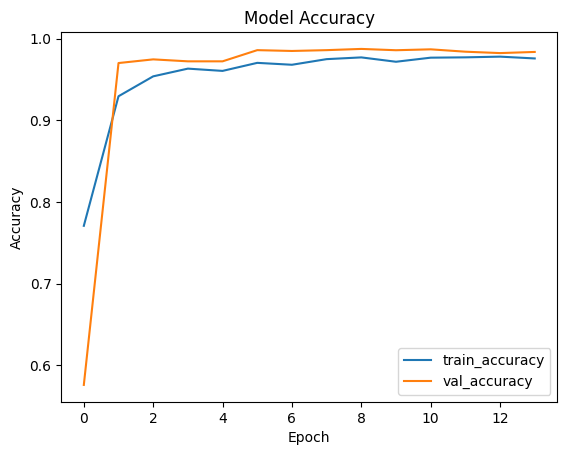
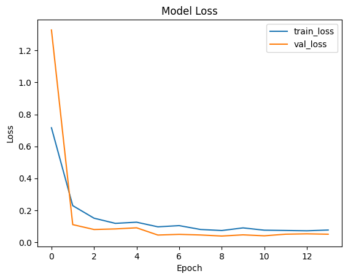
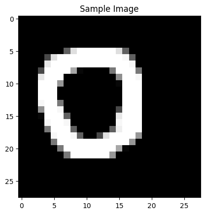
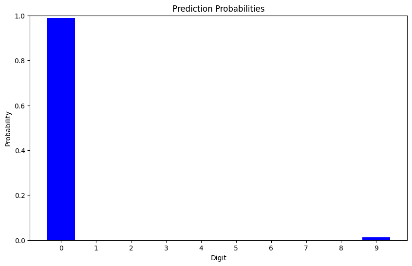

# 🖥️ CNN 기반 MNIST 손글씨 인식 (2024년 실험)

📌 `24_MNIST_0613.ipynb`은 CNN을 활용하여 MNIST 데이터셋을 학습하고, 랜덤 학습률 적용 및 데이터 증강을 활용한 실험을 포함합니다.

---

## 🔍 프로젝트 개요
- **MNIST 데이터셋**을 이용한 손글씨 숫자 분류
- **CNN (합성곱 신경망)**을 활용하여 정확도 향상
- **랜덤 학습률 적용** (0.0001 ~ 0.001)
- **데이터 증강 (ImageDataGenerator) 활용**
- **EarlyStopping 및 ReduceLROnPlateau 사용**

---

## 🛠️ 사용된 기술 및 라이브러리
- **TensorFlow & Keras**: 신경망 모델 구축
- **ImageDataGenerator**: 데이터 증강 적용
- **Adam Optimizer**: 학습률 조절 및 최적화
- **Matplotlib**: 학습 과정 시각화

---

## 📊 주요 실험 결과

| Epoch | Train Accuracy | Val Accuracy |
|--------|---------------|--------------|
| 1      | 79.03%        | 57.09%       |
| 5      | 96.25%        | 98.75%       |
| 13     | 98.79%        | 99.12%       |

**🔹 최종 테스트 정확도:** `99.27%`

---

## 📂 프로젝트 폴더 구조
```
📂 MNIST_CNN_Experiment
 ├── notebooks/
 │    ├── 24_MNIST_0613.ipynb
 ├── images/
 │    ├── Model_Accuracy_2.png
 │    ├── Model_Loss_2.png
 │    ├── Prediction_Probabilities_2.png
 │    ├── Sample_Image_2.png
 ├── README.md
```

---

## 📸 실험 과정 시각화
### 🔹 학습 정확도 변화


### 🔹 학습 손실 변화


### 🔹 손글씨 숫자 예측 (예제 이미지)


### 🔹 예측 확률 분포


---

## 🏁 실행 방법
### 1️⃣ 필수 라이브러리 설치
```bash
pip install tensorflow numpy matplotlib opencv-python
```

### 2️⃣ Jupyter Notebook 실행
```bash
jupyter notebook
```

### 3️⃣ `notebooks/24_MNIST_0613.ipynb` 실행
- 학습이 완료되면 `Model Accuracy`, `Model Loss`를 확인
- 손글씨 숫자 이미지 예측 진행
